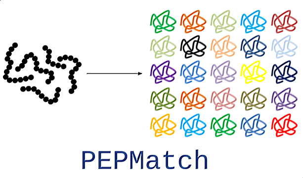

<p align="center">
  
</p>

--------------------------------------------------------------------

#### Author: Daniel Marrama

Peptide search against a reference proteome, or sets of proteins, with residue subtitutions.

Two step process: preprocessing and matching.

Preprocessed data is stored in a SQLite or pickle format and only has to be performed once.

As a competition to improve tool performance, we created a benchmarking framework with instructions [here](./benchmarking).

### Requirements

- Python 3.7+
- [Pandas](https://pandas.pydata.org/)
- [Biopython](https://biopython.org/)
- [Levenshtein](https://pypi.org/project/python-Levenshtein/)

### Installation

```
pip install pepmatch
```


### Inputs

#### Preprocessor

```proteome``` - Path to proteome file to search against.\
```split``` - k-mer size to break up proteome into.\
```preprocessed_format``` - SQLite ("sqlite") or "pickle".\
```preprocessed_files_path``` - Directory where you want preprocessed files to go. Default is current directory.\
```gene_priority_proteome``` - Subset of ```proteome``` with prioritized protein IDs.\
```versioned_ids``` - UniProt or NCBI ID versioning included.

#### Matcher

```query``` - Query of peptides to search either in .fasta file or as a Python list.\
```proteome``` - Name of preprocessed proteome to search against.\
```max_mismatches``` - Maximum number of mismatches (substitutions) for query.\
```split``` - k-mer size of the preprocessed proteome.\
```preprocessed_files_path``` - Directory where preprocessed files are. Default is current directory.\
```one_match``` - (optional) Returns only one match per query peptide. It will output the best match.\
```output_format``` - (optional) Outputs results into a file (CSV, XLSX, JSON, HTML) or just as a dataframe.\
```output_name``` - (optional) Specify name of file for output. Leaving blank will generate a name.

Note: For now, due to performance, SQLite is used for exact matching and pickle is used for mismatching.

### Command Line Example

```bash
pepmatch-preprocess -p human.fasta -k 5 -f sql
pepmatch-match -q peptides.fasta -p 9606 -m 0 -k 5
```

### Exact Matching Example

```python
from pepmatch import Preprocessor, Matcher

# proteome, k, preprocessed_format, target directory, gene_priority_proteome
Preprocessor('proteomes/human.fasta', 'sql', '.', 'proteomes/human_gp.fasta').preprocess(k=5)
# PREPROCESSING ONLY NEEDS TO BE DONE ONCE!

# query, proteome, max_mismatches, k, preprocessed files directory
Matcher('queries/mhc_ligands_test.fasta', 'proteomes/human.fasta', 0, 5, '.').match()
```


### Mismatching Example 

```python
from pepmatch import Preprocessor, Matcher

# proteome, k, preprocessed_format, target directory
Preprocessor('proteomes/human.fasta', 'pickle', '.').preprocess(k=3)
# PREPROCESSING ONLY NEEDS TO BE DONE ONCE!

# query, proteome, max_mismatches, k, preprocessed files directory
Matcher('queries/neoepitopes_test.fasta', 'proteomes/human.fasta', 3, 3, '.').match()
```

### Outputs

As mentioned above, outputs can be specified with the ```output_format``` parameter in the ```Matcher``` class. The following formats are allowed: 'dataframe', 'csv', 'xlsx', 'json', and 'html'.

If specifying 'dataframe', the ```match()``` method will return a pandas dataframe which can be stored as a variable as so:

```python
df = Matcher('queries/neoepitopes_test.fasta', 'human.fasta', 3, 3, output_format='dataframe').match()
```

### TODO
- Add test workflows for GitHub Actions
- Add multithreading option
- Remove dependency on Levenshtein (this is not maintained very well)